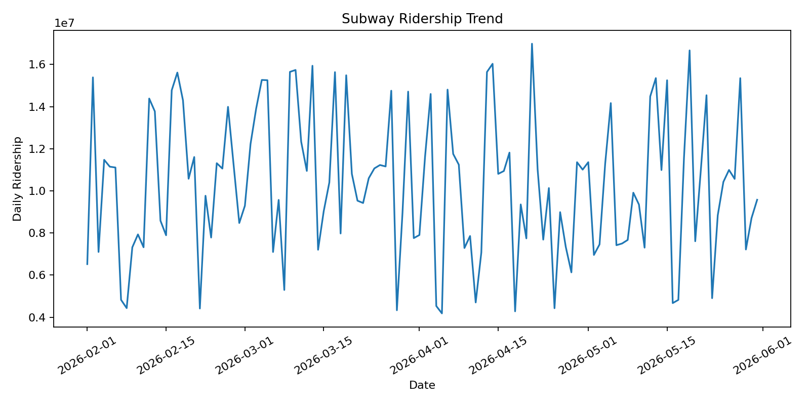
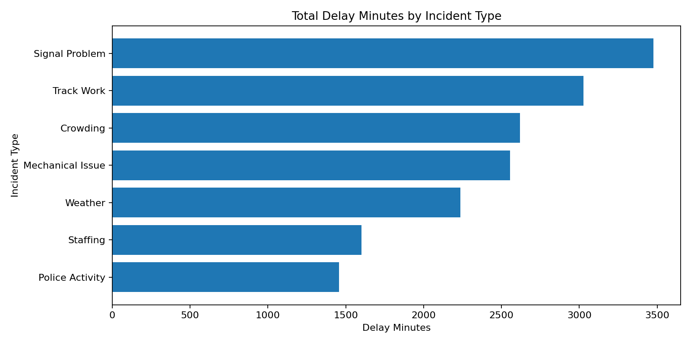
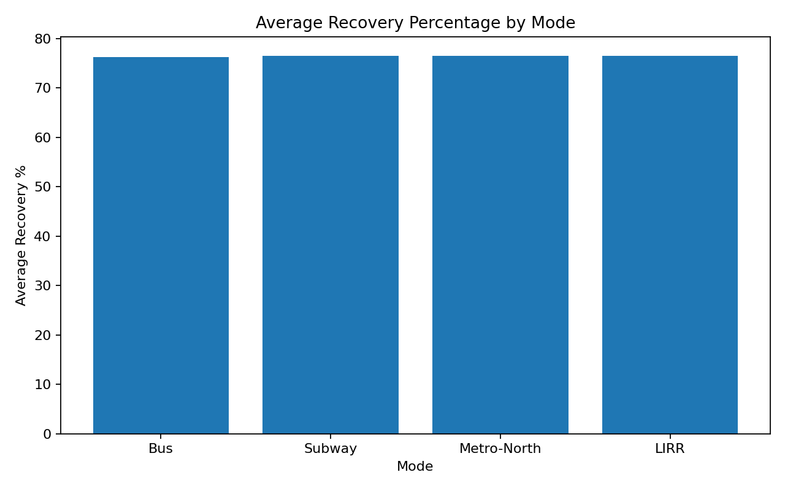

# 🚇 MTA Ridership & Service Reliability Analytics Dashboard

> **Author:** Tasfia Hasan  
> **Role Alignment:** Data Analyst | Business Intelligence | Transportation Analytics  
> **Tools:** Python, Pandas, NumPy, Matplotlib, Excel, Power BI

---

## 📌 Project Overview

This project analyzes **MTA-style transit ridership and service reliability** using Python and data analytics techniques. It demonstrates an end-to-end analytics workflow including data cleaning, KPI generation, exploratory data analysis (EDA), visualization, and dashboard-ready reporting.

The objective is to identify ridership trends, service disruptions, and operational performance metrics that can support data-driven decision making for public transportation agencies.

---

# 📊 Dashboard Preview

## 🚆 Subway Ridership Trend



This visualization tracks daily subway ridership over time, allowing analysts to identify usage patterns, unusual fluctuations, and overall ridership trends.

---

## 🚧 Total Delay Minutes by Incident Type



This chart highlights which operational incidents contribute the most service delays.

### Key Findings

- Signal Problems generated the highest delay minutes.
- Track Work was the second-largest contributor.
- Mechanical Issues and Crowding also had significant operational impact.
- Staffing and Police Activity resulted in comparatively lower delay totals.

---

## 📈 Average Recovery Percentage by Transit Mode



This visualization compares recovery performance across different transportation modes, providing insight into operational consistency and service restoration.

---

# 📊 Key Performance Indicators (KPIs)

The analysis generates the following performance metrics:

- 📌 Total Ridership
- 📌 Average Daily Ridership
- 📌 Average Recovery Percentage
- 📌 Total Delay Minutes
- 📌 Incident Count
- 📌 Top Delay Segments
- 📌 Mode-Level Performance Summary

---

# ❓ Business Questions Answered

This project answers several operational and business questions, including:

- Which transit modes experience the highest ridership?
- Which incident categories generate the most delay minutes?
- Which routes and regions should receive operational attention?
- How effectively are transit services recovering after disruptions?
- Which KPIs should leadership monitor to improve service reliability?

---

# 🛠 Technologies Used

- Python
- Pandas
- NumPy
- Matplotlib
- CSV
- Microsoft Excel
- Power BI
- Git
- GitHub

---

# 📂 Project Structure

```text
mta-ridership-reliability-dashboard/
│
├── data/
│   └── mta_ridership_reliability_sample.csv
│
├── reports/
│   ├── mode_summary.csv
│   ├── top_delay_segments.csv
│   └── figures/
│       ├── subway_ridership_trend.png
│       ├── delay_by_incident_type.png
│       └── recovery_by_mode.png
│
├── src/
│   └── analyze_mta.py
│
├── requirements.txt
│
└── README.md
```

---

# 🚀 How to Run

Clone the repository:

```bash
git clone https://github.com/thasan26/mta-ridership-reliability-dashboard.git
```

Navigate into the project:

```bash
cd mta-ridership-reliability-dashboard
```

Install dependencies:

```bash
pip install -r requirements.txt
```

Run the analysis:

```bash
python src/analyze_mta.py
```

---

# 📊 Power BI Dashboard Suggestions

The generated dataset can be imported directly into **Power BI**.

Recommended dashboard visuals:

- KPI Cards
  - Total Ridership
  - Average Recovery %
  - Total Delay Minutes
  - Incident Count

- Line Chart
  - Daily Ridership Trend

- Bar Chart
  - Delay Minutes by Incident Type

- Matrix/Table
  - Transit Mode
  - Route
  - Region
  - Recovery Percentage
  - Delay Minutes

- Interactive Slicers
  - Transit Mode
  - Incident Type
  - Region
  - Peak Period

---

# 💡 Key Insights

### Ridership

- Daily subway ridership fluctuates throughout the reporting period.
- Trend analysis can identify periods requiring operational adjustments.

### Service Reliability

- Signal Problems remain the leading contributor to operational delays.
- Track Work continues to significantly impact service performance.
- Mechanical failures also account for a large portion of delay minutes.

### Recovery Performance

- Recovery percentages remain relatively consistent across transportation modes.
- Performance monitoring enables agencies to measure operational resilience.

---

# 🎯 Skills Demonstrated

- Data Cleaning
- Data Wrangling
- Exploratory Data Analysis (EDA)
- KPI Development
- Business Intelligence
- Dashboard Design
- Transportation Analytics
- Python Programming
- Pandas
- NumPy
- Matplotlib
- Data Visualization
- Power BI Preparation
- Git & GitHub

---

# 📌 Future Improvements

Potential enhancements include:

- Interactive Power BI Dashboard
- Predictive Delay Forecasting using Machine Learning
- Real-Time Transit Data Integration via APIs
- Geographic Delay Heat Maps
- Route-Level Reliability Dashboard
- Automated Monthly KPI Reports

---

# ⭐ Repository Highlights

This project demonstrates practical data analytics skills by transforming raw transit data into actionable insights through Python, statistical analysis, KPI reporting, and dashboard-ready visualizations. It showcases the complete workflow expected in data analyst and business intelligence roles, from data preparation to executive reporting.

---

## 📬 Contact

**Tasfia Hasan**

- LinkedIn: https://www.linkedin.com/in/YOUR-LINKEDIN
- GitHub: https://github.com/thasan26

If you found this project useful, feel free to ⭐ the repository!
